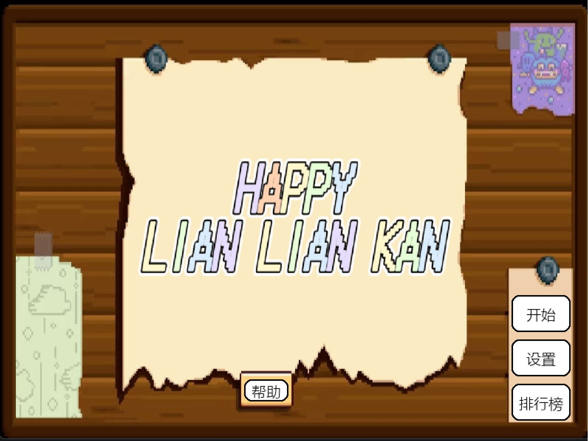
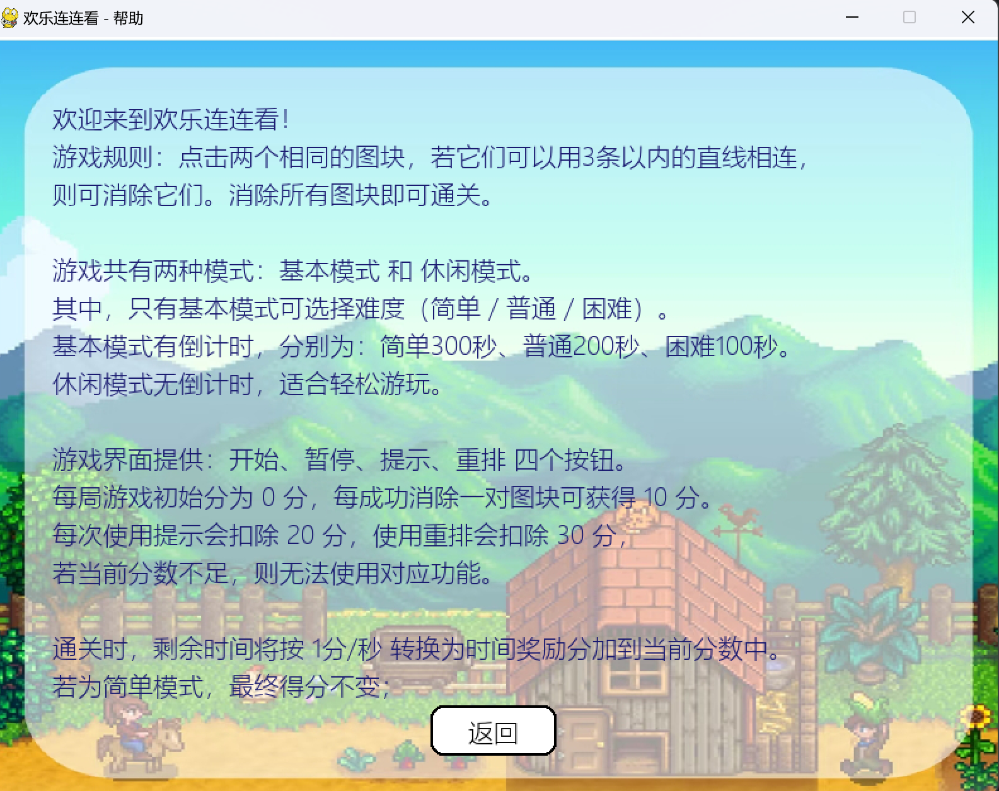
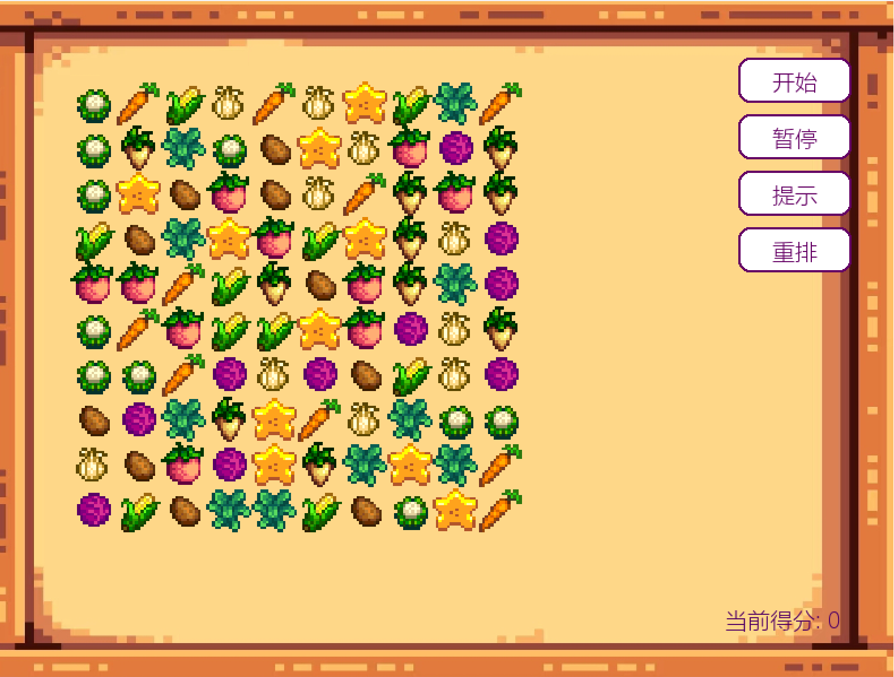
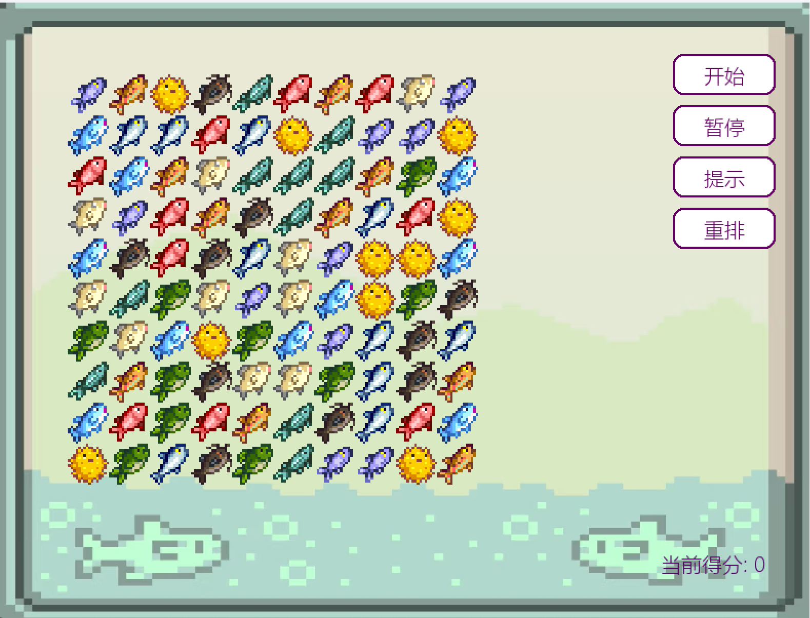
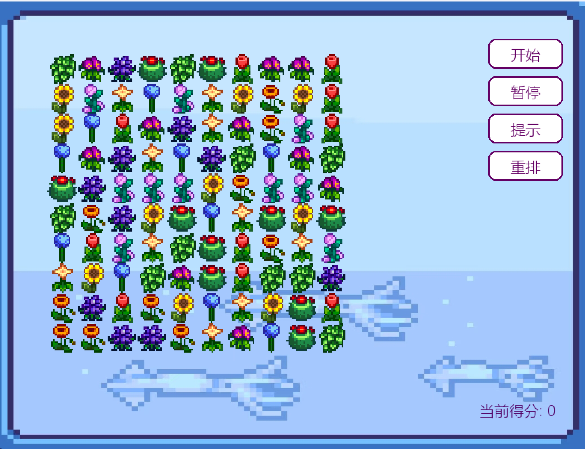

# 🌾 Stardew Valley Style Link Game

> A **Stardew Valley–style** relaxing puzzle game built with **Python + Pygame**.  

> Uses graph structure and BFS algorithm for pathfinding and supports multiple themes, ranking, scoring, hints, and reshuffling.  

> Includes a **Windows executable (.exe)** — no Python required.

---

## 🎮 Introduction

This project is a comprehensive practice for data structures and algorithms.  

It implements the “Link Game” mechanics using 2D arrays, graph structures, and BFS pathfinding.  

The art style is inspired by *Stardew Valley*, combining algorithmic logic with casual gameplay.

---

## 🌟 Features

- Graph structure + BFS connection detection  

- Hint / Shuffle / Timer / Score / Pause / Ranking / Settings / Help  

- Modular design (separate UI and logic layers)  

- Packaged executable for quick play  

  

  

  

  

  

---

## 📂 Project Structure

StardewValleyLinkingGame/

├── Main.py

├── UI/ 

│ ├── Menu.py

│ ├── Game.py

│ ├── GameLevel.py

│ ├── GamePic.py

│ ├── Ranking.py

│ ├── Settings.py

│ └── Help.py

│

├── Game/ 

│ ├── constants.py

│ ├── Control.py

│ └── Logic.py

│

├── assets/ 

├── screenshots/

├──DISCLAIMER.md

└── README.md

---

## 🕹️ How to Run

### ✅ Method 1: Run Executable (Recommended)

1. 👉 Download the latest release：https://github.com/SummerNeverEnds/StardewValleyLinkingGame/releases

2. Double-click to start playing — no Python installation needed  

### 💻 Method 2: Clone it Locally and Run the Source Code Yourself（python main.py）

